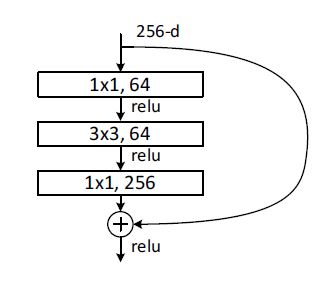
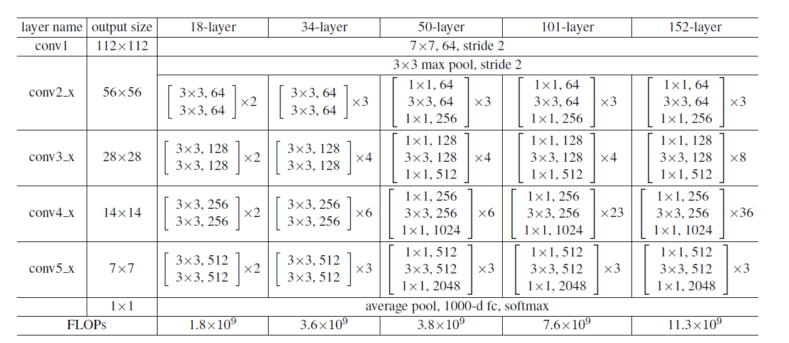

This is the README for v1.0 using the TensorFlow2 model. The pre-v1.0 README using the TensorFlow1 model is [here](./README_old.md).

# 1. Summary
The purpose of this benchmark is to evaluate the performance of a ResNet50 network for image classification.  In computer vision, the task of image classification entails the assignment of a single class label to a given input image.  For example, in the graphic below, the image classification system assigns the label "soccer_ball" to the input image with 93.43% confidence: 


ImageNet is a standard dataset for evaluating the performance of deep neural networks on classification tasks.  ImageNet contains more than 14 million hand-annotated images from over 20,000 categories, such as peacock, eggnog, and corn.

This benchmark uses ResNet50 v1.5 to classify images from the ImageNet dataset with a fork from
https://github.com/tensorflow/models/tree/master/official/vision/image_classification/resnet .

# 2. Dataset/Environment
## Publication/Attribution
We use Imagenet (http://image-net.org/):

    O. Russakovsky, J. Deng, H. Su, J. Krause, S. Satheesh, S. Ma,
    Z. Huang, A. Karpathy, A. Khosla, M. Bernstein, et al. Imagenet
    large scale visual recognition challenge. arXiv:1409.0575, 2014.


## Data preprocessing

There are two stages to the data processing. 1) Download and package images
for training that takes place once for a given dataset. 2) Processing as part
of training often called the input pipeline.

**Stage 1**

In the first stage, the images are not manipulated other than converting pngs
to jpegs and a few jpegs encoded with cmyk to rgb. In both instances the quality
saved is 100. The purpose is to get the images into a format that is faster
for reading, e.g. TFRecords or LMDB. Some frameworks suggest resizing images as
part of this phase to reduce I/O. Check the rules to see if resizing or other
manipulations are allowed and if this stage is on the clock.

The following [script](https://github.com/tensorflow/tpu/blob/master/tools/datasets/imagenet_to_gcs.py)
was used to create TFRecords from ImageNet data using instructions in the
[README](https://github.com/tensorflow/tpu/tree/master/tools/datasets#imagenet_to_gcspy).
TFRecords can be created directly from [ImageNet](http://image-net.org) or from
the .tar files downloaded from image-net.org.

**Stage 2**

The second stage takes place as part of training and includes cropping, apply
bounding boxes, and some basic color augmentation. The [reference model](https://github.com/mlperf/training/blob/master/image_classification/tensorflow/official/resnet/imagenet_preprocessing.py)
is to be followed.


## Training and test data separation
This is provided by the Imagenet dataset and original authors.

## Training data order
Each epoch goes over all the training data, shuffled every epoch.

## Test data order
We use all the data for evaluation. We don't provide an order for of data
traversal for evaluation.

# 3. Model
The model used in this benchmark is a ResNet50 deep network, which was first introduced in 2015 [1].  Prior to the introduction of ResNet, some of the deepest networks included VGG and GoogleNet, with only 19 and 22 layers, respectively. In theory, the deeper the network, the greater its capacity, which in turn allows it to approximate increasingly complex functions.  However, prior to ResNet's release, practically it was observed that very deep networks exhibited higher errors on training data compared to their shallower counterparts.  The ground-breaking contribution of ResNet [1][2] was the introduction of the residual block, which configured the network to approximate a residual mapping rather than the underlying original mapping.  An image of a residual block is shown in the figure below.  The advantages of the residual block are two-fold: i) Allow for faster convergence of optimizers. ii) Avoid vanishing gradients.


In the figure below, a VGG-19 network (left) is compared with a 34-layer plain network (center) and a 34-layer residual network. 


[1] [Deep Residual Learning for Image Recognition](https://arxiv.org/abs/1512.03385) by Kaiming He, Xiangyu Zhang, Shaoqing Ren, and Jian Sun, Dec 2015.

[2] [Identity Mappings in Deep Residual Networks](https://arxiv.org/abs/1603.05027) by Kaiming He, Xiangyu Zhang, Shaoqing Ren, and Jian Sun, Jul 2016.


## Structure
For this benchmark, a 50 layer ResNet architecture is used.  In the 50-layer variant of ResNet, a 3-layer bottleneck building block is adopted, as shown in the figure below.  



The overall network architecture for ResNet50 is shown in the center of the following table.  In total, 16 of the 3-layer residual blocks are used in addition to an initial convolutional layer and a final fully connected layer.



One final subtle note of distinction is that this benchmark uses a slight variant of the original ResNet bottleneck building block [1]. This modified version changes where striding is performed when downsampling.  In the original ResNet implementation, a stride = 2 was used during the first 1x1 convolution within the bottleneck building blocks; however, the v1.5 variant uses stride = 2 during the 3x3 convolution.  As such, this benchmark actually uses ResNet50 v1.5 rather than the original ResNet50 v1 from [1].  The rationale for using ResNet50 v1.5 is that it offers slightly higher accuracies at the expense of marginally slower speed. 

## Loss function
Details of the loss function can be found here:
[Deep Residual Learning for Image Recognition](https://arxiv.org/pdf/1512.03385.pdf).


## Weight and bias initialization
Weight initialization is done as described here in
[Delving Deep into Rectifiers: Surpassing Human-Level Performance on ImageNet Classification](https://arxiv.org/abs/1502.01852).


## Optimizer
Either SGD Momentum based optimizer, or the [LARS optimizer](https://arxiv.org/abs/1708.03888) can be used.  
MLCommons RCP Hyperparemeters can be found [here](https://github.com/mlcommons/logging/tree/master/mlperf_logging/rcp_checker) 


# 4. Quality
## Quality metric
Percent of correct classifications on the Image Net test dataset.

## Quality target
We run to 0.759 accuracy (75.9% correct classifications).

## Evaluation frequency
We evaluate after every 4 epochs; the first evaluation can happen after 1, 2, 3, or 4 epochs of training.

## Evaluation thoroughness
Every test example is used each time.


# 5. Steps to run the model

## On GPU-V100-8

```shell

python3 ./resnet_ctl_imagenet_main.py \
--base_learning_rate=8.5 \
--batch_size=1024 \
--clean \
--data_dir=<input data path> \
--datasets_num_private_threads=32 \
--dtype=fp32 \
--device_warmup_steps=1 \
--noenable_device_warmup \
--enable_eager \
--noenable_xla \
--epochs_between_evals=4 \
--noeval_dataset_cache \
--eval_offset_epochs=2 \
--eval_prefetch_batchs=192 \
--label_smoothing=0.1 \
--lars_epsilon=0 \
--log_steps=125 \
--lr_schedule=polynomial \
--model_dir=<output model path> \
--momentum=0.9 \
--num_accumulation_steps=2 \
--num_classes=1000 \
--num_gpus=8 \
--optimizer=LARS \
--noreport_accuracy_metrics \
--single_l2_loss_op \
--noskip_eval \
--steps_per_loop=1252 \
--target_accuracy=0.759 \
--notf_data_experimental_slack \
--tf_gpu_thread_mode=gpu_private \
--notrace_warmup \
--train_epochs=41 \
--notraining_dataset_cache \
--training_prefetch_batchs=128 \
--nouse_synthetic_data \
--warmup_epochs=5 \
--weight_decay=0.0002

```
Note: Because there is no recommended hyperparameter set for batch size 1024, the above command uses a hyperparameter set for batch size 2048 and num_accumulation_steps=2; this reduces the chance of convergence. To avoid this, use 1) V100-16, 2) V100s with 32GB memory, 3) A100-8, or 4) dtype=fp16.

The model has been tested using the following stack:
- Debian GNU/Linux 10 GNU/Linux 4.19.0-12-amd64 x86_64
- NVIDIA Driver 450.51.06
- NVIDIA Docker 2.5.0-1 + Docker 19.03.13
- docker image tensorflow/tensorflow:2.4.0-gpu

## On TPU-V3-64

To run the training workload for batch size 4k on [Cloud TPUs](https://cloud.google.com/tpu), follow these steps:

- Create a GCP host instance

```shell

gcloud compute instances create <host instance name> \
--boot-disk-auto-delete \
--boot-disk-size 2048 \
--boot-disk-type pd-standard \
--format json \
--image debian-10-tf-2-4-0-v20201215 \
--image-project ml-images \
--machine-type n1-highmem-96 \
--min-cpu-platform skylake \
--network-interface network=default,network-tier=PREMIUM,nic-type=VIRTIO_NET \
--no-restart-on-failure \
--project <GCP project> \
--quiet \
--scopes cloud-platform \
--tags perfkitbenchmarker \
--zone <GCP zone> \

```

- Create the TPU instance

```shell

gcloud compute tpus create <tpu instance name> \
--accelerator-type v3-64 \
--format json \
--network default \
--project <GCP project> \
--quiet \
--range <some IP range, e.g. 10.193.80.0/28> \
--version 2.4.0 \
--zone <GCP zone>

```

- double check software versions.
The Python version should be 3.7.3, and the tensorflow version should be 2.4.0.

- Run the training script

```shell

python3 ./resnet_ctl_imagenet_main.py \
--base_learning_rate=10.0 \
--batch_size=4096 \
--nocache_decoded_image \
--clean \
--data_dir=gs://<input data GCS path> \
--device_warmup_steps=1 \
--distribution_strategy=tpu \
--dtype=fp32 \
--noenable_checkpoint_and_export \
--noenable_device_warmup \
--enable_eager \
--epochs_between_evals=4 \
--noeval_dataset_cache \
--eval_offset_epochs=2 \
--label_smoothing=0.1 \
--lars_epsilon=0 \
--log_steps=125 \
--lr_schedule=polynomial \
--model_dir=gs://<output GCS path> \
--optimizer=LARS \
--noreport_accuracy_metrics \
--single_l2_loss_op \
--steps_per_loop=313 \
--tpu=<tpu name> \
--tpu_zone=<tpu zone> \
--train_epochs=42 \
--notraining_dataset_cache \
--notrace_warmup \
--nouse_synthetic_data \
--use_tf_function \
--verbosity=0 \
--warmup_epochs=5 \
--weight_decay=0.0002 \
--target_accuracy=0.759 \
--momentum=0.9 \
--num_replicas=64 \
--num_accumulation_steps=1 \
--num_classes=1000 \
--noskip_eval

```
